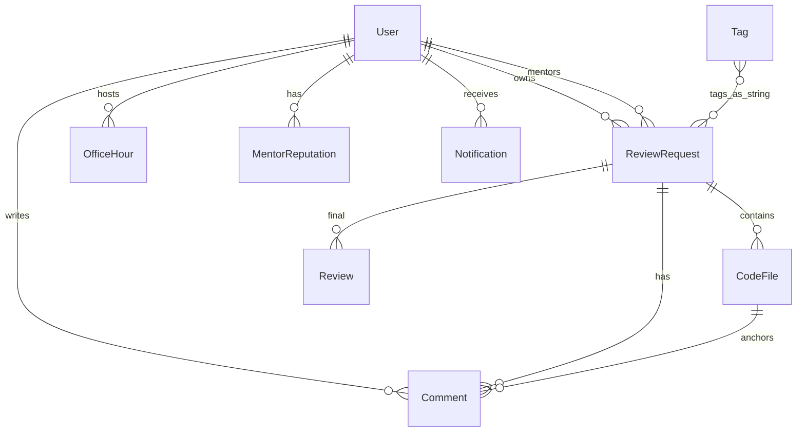

# DevReview — Projekat 12

Platforma na kojoj junior developeri postavljaju isečke koda i traže review od iskusnijih mentora. Mentori preuzimaju zahteve, ostavljaju inline komentare i zaključni rezime; korisnici grade reputaciju; sistem rangira mentore po jeziku/framework-u.

## Struktura rešenja

| Sloj | Projekat | Uloga |
|------|----------|--------|
| **API** | `DevReview.API` | REST kontroleri, JWT, Swagger, middleware |
| **Aplikacija** | `DevReview.Application` | CQRS (MediatR), FluentValidation, DTO, AutoMapper |
| **Domen** | `DevReview.Domain` | Entiteti, enumi |
| **Infrastruktura** | `DevReview.Infrastructure` | EF Core, PostgreSQL, repozitorijumi, Unit of Work, seed |
| **Frontend** | `DevReviewFrontend` | React + TypeScript + Vite + Tailwind |

**Arhitektura:** Clean Architecture (Domain → Application → Infrastructure → API), CQRS preko MediatR-a.

**Baza:** PostgreSQL (`Npgsql.EntityFrameworkCore.PostgreSQL`).

## Pokretanje

### Preduslovi

- .NET 10 SDK
- Node.js 20+
- PostgreSQL (connection string u `DevReview.API/appsettings.json`)

### Backend

```bash
cd DevReview.API
dotnet ef database update --project ../DevReview.Infrastructure
dotnet run
```

API: `http://localhost:5147` · Swagger: `http://localhost:5147/swagger`  
Sve rute: **`/api/v1/...`** (npr. `/api/v1/auth/login`, `/api/v1/review-requests`)

### Frontend

```bash
cd DevReviewFrontend
npm install
npm run dev
```

UI: `http://localhost:5173` (proxy `/api` → backend)

### Seed nalozi

| Uloga | Korisnik | Lozinka |
|-------|----------|---------|
| Admin | `admin` | `Admin123!` |
| Mentor | `mentor` | `Mentor123!` |
| Autor | `author` | `Author123!` |

---

## Usklađenost sa PROJEKT 12 — matrica

Legenda: **✅** implementirano · **🟡** delimično · **❌** nije / nije u specifikaciji backend-a

### Zajednički zahtevi (ocena projekta)

| Zahtev | Status | Gde u kodu |
|--------|--------|------------|
| Repository + Unit of Work | ✅ | `IGenericRepository`, `IUnitOfWork`, `Infrastructure/Repositories` |
| AutoMapper | ✅ | `Application/Mappings/MappingProfile.cs` |
| Clean Architecture | ✅ | 4 projekta, zavisnosti ka domenу |
| CQRS + MediatR | ✅ | `*Command`, `*Query`, `*Handlers` |
| JWT access token | ✅ | `AuthController`, `JwtTokenService` |
| Refresh token | ✅ | `UserRefreshTokens` tabela, rotacija + revoke pri logout (`RefreshTokenService`) |
| FluentValidation | ✅ | `Application/Validators/*` |
| Global exception handler | ✅ | `ExceptionMiddleware` — **RFC 7807** (`application/problem+json`) |
| Swagger/OpenAPI | ✅ | `Program.cs`, Bearer šema |
| API verzionisanje | ✅ | Sve rute pod `/api/v1/...` (`ApiRouteConvention`) |
| Serilog | ✅ | Konzola + `Logs/devreview-*.log` (`appsettings.json` → `Serilog`) |
| **Custom middleware (XSS sanitization)** | ✅ | `InputSanitizationMiddleware` + **HtmlSanitizer** (`appsettings.json` → `Sanitization:Fields`) |
| README + ER dijagram | 🟡 | Ovaj README; ER treba dodati (npr. draw.io / Mermaid) |

### Profili i uloge

| Zahtev | Status | Napomena |
|--------|--------|----------|
| Uloge Author, Mentor, Admin | ✅ | `UserRoles`; jedna uloga po korisniku u bazi |
| Autor **i** mentor istovremeno | 🟡 | Spec traži kombinaciju; model ima **jedno** `Role` polje |
| Profil: ime, biografija, GitHub, satnica, dostupni sati | ✅ | `PUT /api/v1/profiles/me` + forma na `/profile` |
| Jezici/framework-i sa nivoom | ✅ | `MentorReputation` + `LanguageExpertiseDto` (score po jeziku) |
| Reputacija 1–5 po review-u | ✅ | `Review.Rating` + `AuthorRatingOfMentor` / `MentorRatingOfAuthor` (`POST .../rate`) |
| Frontend profil | ✅ | `/profile` — prikaz i izmena |

### Review zahtevi

| Zahtev | Status | API / UI |
|--------|--------|----------|
| Naslov, opis, jezik, framework, težina, tagovi | ✅ | `CreateReviewRequestCommand`, forma |
| Javan / privatan | ✅ | `IsPublic` (backend + forma) |
| Paste više fajlova | ✅ | `CodeFiles[]` |
| Upload ZIP | ✅ | `POST /api/v1/review-requests/parse-zip` + UI na formi |
| Besplatan / plaćen + cena | ✅ | `IsPaid`, `Price` |
| Životni ciklus Open → Claimed → InReview → Completed / Abandoned | ✅ | `ReviewStatus`, handleri |
| Pretraga / filteri za mentore | ✅ | `GET /api/search/review-requests` + UI filteri |
| Claim | ✅ | `POST .../claim`, `ClaimTimeout` (+2 dana) |
| Timeout neaktivnog mentora (automatski) | ✅ | `ClaimTimeoutBackgroundService` (svakih 15 min) |
| Mentor napušta zahtev | ✅ | `POST .../abandon` + UI |
| Završni summary + ocena | ✅ | `POST .../finalize` + UI |

### Inline komentari

| Zahtev | Status | Napomena |
|--------|--------|----------|
| Komentar po fajlu / liniji | ✅ | `CodeFilePath`, `StartLine`, `EndLine` (entitet + UI polja) |
| Tipovi Suggestion, Question, Praise, Critical | ✅ | `CommentType` (plus `General`) |
| Predlog izmene (diff) + apply jednim klikom | 🟡 | `SuggestedCode` u API/UI; **nema** apply jednim klikom |
| Diskusija — odgovor na komentar | ✅ | `ParentCommentId`, thread u UI |
| Mentor označava rešeno | ✅ | `POST .../comments/{id}/resolve` |
| Zatvaranje na ≥80% rešenih | ✅ | Provera u `SubmitFinalReviewCommandHandler` |

### Office hours

| Zahtev | Status | Napomena |
|--------|--------|----------|
| Mentor objavljuje termine | ✅ | `POST /api/officehours` |
| Rezervacija + opis | ✅ | `POST .../book` |
| Utisci obe strane | ✅ | `POST .../feedback` |
| Otkazivanje (mentor ili autor) | ✅ | `POST .../cancel` |
| Autor vidi svoje bookinge | ✅ | `GET /api/v1/officehours/my-bookings` |

### Reputacija i rang

| Zahtev | Status | Napomena |
|--------|--------|----------|
| Reputacija po jeziku | ✅ | `MentorReputation` |
| Top mentori | ✅ | `GET /api/mentors/top` |
| Top mentori **ove nedelje** | ✅ | `GET /api/v1/mentors/top?period=week` + UI |
| Pretraga mentora | ✅ | `GET /api/search/mentors` |
| Autor ocenjuje mentora / mentor ocenjuje autora | ✅ | `POST .../rate` posle Completed |

### Pretraga i otkrivanje

| Zahtev | Status | Napomena |
|--------|--------|----------|
| Pretraga zahteva | ✅ | SearchController |
| Javni review-ovi kao baza znanja | ✅ | `GET /api/v1/review-requests/public` + `/knowledge-base` |

### Notifikacije

| Zahtev | Status | Napomena |
|--------|--------|----------|
| Novi komentar, claim, completed, office hours… | ✅ | `Notification` + handleri |
| Praćenje mentora | ❌ | Nema follow modela |

### Admin

| Zahtev | Status | Napomena |
|--------|--------|----------|
| Blokiranje korisnika | ✅ | `AdminController` |
| Tagovi (kategorije) | ✅ | `TagsController` + admin UI |
| Statistike | ✅ | `GET /admin/statistics` |
| Moderacija sadržaja (review/komentari) | 🟡 | Samo block user |

### Frontend (pokrivenost API-ja)

| Modul | Stranice |
|-------|----------|
| Auth | login, register, JWT refresh |
| Review requests | lista (search), moje, detalj, novi, claim, abandon, finalize, komentari |
| Mentori | `/mentors` (top + search) |
| Office hours | dostupni, booking, mentor raspored, feedback |
| Notifikacije | bell + `/notifications` |
| Admin | dashboard, korisnici, tagovi |
| Profil | `/profile` (read-only) |

---

## Procena spremnosti za odbranu

| Oblast | Procenat |
|--------|----------|
| Jezgro (review + mentor + auth + admin) | ~85% |
| Projekat 12 — pun spec (XSS, ZIP, diskusije, plaćanja, ER, Serilog…) | ~55% |
| Frontend ↔ backend API | ~95% |

**Za visoku ocenu na specifikaciji preporučeno je (prioritet):**

1. **README ER dijagram** (Mermaid ili slika entiteta) — skica postoji, može se proširiti  
2. **Serilog** (strukturirani logovi)  
4. **Profil**: biografija, GitHub, izmena profila; opciono dual-role  
5. **Komentari**: `SuggestedCode`, resolve, thread odgovori  
6. **Javna baza** završenih review-a (`IsPublic` + read-only ruta)  
7. **ZIP upload** ili dokumentovati zašto je paste dovoljan u MVP-u  

---

## Dijagram entiteta (pojednostavljen)



---

## API pregled (kontroleri)

| Kontroler | Rute |
|-----------|------|
| `Auth` | register, login, refresh, logout, me |
| `Profiles` | me |
| `ReviewRequests` | CRUD tok, claim, abandon, comments, finalize |
| `Search` | review-requests, mentors |
| `Mentors` | top |
| `OfficeHours` | available, schedule, create, book, cancel, feedback |
| `Notifications` | list, read, read-all |
| `Tags` | CRUD (admin) |
| `Admin` | users, block, unblock, statistics |

---

## Autor

Studentski projekat — **Projekat 12, DevReview**.  
Backend: ASP.NET Core · Frontend: React + Vite.
